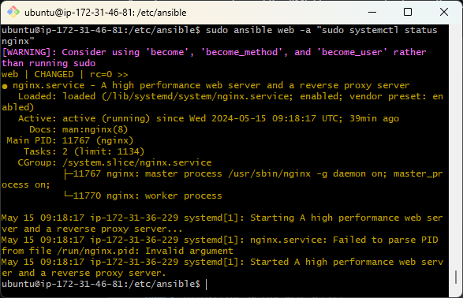

# Ansible


1. Create ec2 run update upgrade
```bash
2. sudo apt-get install software-properties-common
3. sudo apt-add-repository ppa:ansible/ansible
4. sudo apt-get update -y
5. sudo apt-get install ansible -y
6. sudo ansible --version
7. cd /etc/ansible # (where we run commands)
8. ls ----> ansible.cfg hosts roles
# app machine = web db machine = db
9. sudo ansible web -m ping
10.  sudo nano hosts
# app ip 34.254.90.199 db ip 54.246.172.14
11.  sudo ansible web -m ping
12.  scp -i ~/.ssh/tech258.pem ~/.ssh/tech258.pem ubuntu@34.248.241.223:~/.ssh/ # scp key into .ssh folder 
13.  sudo chmod 400 "tech258.pem"
14.  can now ssh into app or db from controller
15.  cd /etc/ansible
16.  provide address of key in hosts file
[agent_nodes]
web ansible_host=34.245.216.253
db ansible_host=3.255.90.87
 
[agent_nodes:vars]
ansible_user=ubuntu
ansible_ssh_private_key_file=~/.ssh/tech258.pem
or
[web]
ec2-instance-app ansible_host=54.216.9.103 ansible_user=ubuntu ansible_ssh_private_key_file=~/.ssh/tech258.pem
```
```bash
sudo ansible all -m ping # pings all instances

sudo apt-get install tree -y

ping 54.216.9.103 # test instance are communicating

17. sudo ansible web -a "uname -a"
Agentless: we don't need to install ansible on any other instance. Ansible needs python
sudo ansible all -a "uname -a"

sudo ansible web -a "free" ~ checks free memory
sudo ansible all -a "date"

```
ad hoc commands
https://docs.ansible.com/ansible/latest/user_guide/intro_adhoc.html

```bash
sudo ansible all -a "sudo apt-get update -y"

sudo ansible web -a "ls -a"

sudo ansible web -a "ls -a" -vvv # shows log

# using ad hoc command copy file into instances

sudo ansible agent_nodes -m copy -a "src=/home/ubuntu/testing-controller.txt dest=/home/ubuntu"
```
## Avoid SSH fingerprint
```bash
[ssh_connection]
ssh_args = -o StrictHostKeyChecking=no
```
## Create a play to install nginx on web server
Creating a playbook to automate configuration of nginx without SSH into machine
1. sudo nano nginx-play.yml 
(for YML files we seperate steps with ---)
2. Write pseudo code  in comments and code
```yml
# creating a playbook to install/config nginx in the web server
---
# YML starts with three dashes

# add the name of the host: web
- hosts: web

# see the logs whilst executing (gather facts)
  gather_facts: yes

# provide admin access - sudo
  become: true

# add instructions to install nginx on web server
# ensure nginx is in running state
  tasks:
  - name: Installing Nginx web server
    apt: pkg=nginx state=present
```
3. Run the play `sudo ansible-playbook nginx-play.yml`
4. `sudo ansible web -a "sudo systemctl status nginx" # check nginx is running `
