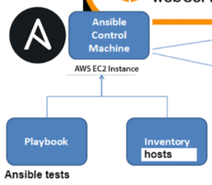

# Infrastructure as Code
## Definition
Helps us codify anything and everything, it helps us write a language that we can read and understand to instruct machines to execute tasks accordingly. 
Automating, managing and orchestrating the launching and scaling of cloud services.

## Benefits
If we have 100 instance that all need nginx on them I have the knowledge and the capacity to achieve this goal, however it would take some time. IaC speeds up this process.

## Why Ansible
- Open source(free)
- Simple to use(YAML)
- Powerful
## How Ansible works
Control Node: The system where Ansible is installed and from which commands are run. 
Managed Nodes: The systems that Ansible manages, also known as target systems or hosts. 
Ansible uses an inventory file to define the list of managed nodes. This file can be in various formats such as INI, YAML, or dynamic inventory scripts. 
Modules are the units of work in Ansible. They are scripts that perform specific tasks like installing packages, managing services, or handling files. Ansible comes with a large number of built-in modules, and users can write custom ones. 
 
Playbooks are YAML files that define a series of tasks to be executed on the managed nodes. They allow for complex configurations and workflows, specifying the desired state of the systems. 

## Why Terraform