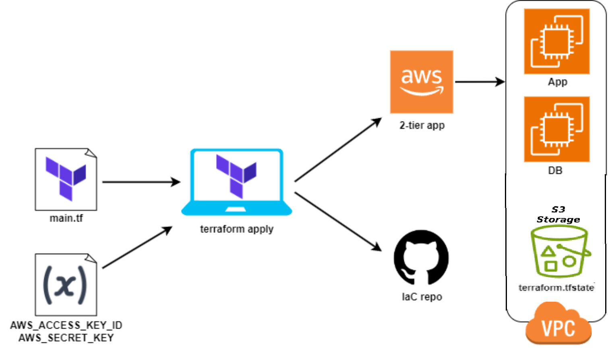

# Infrastructure as Code
## Definition
Helps us codify anything and everything, it helps us write a language that we can read and understand to instruct machines to execute tasks accordingly.<br>
Automating, managing and orchestrating the launching and scaling of cloud services.
**Configuration management** changing things within an instance. Installations Updates etc<br>
**Orchestration** is working outside the instances. VPC SG Ports<br>
1. Provisioning (providing) main.tf Terraform
2. Configures playbook.yml Ansible<br>

## Benefits
If we have 100 instance that all need nginx on them I have the knowledge and the capacity to achieve this goal, however it would take some time. IaC speeds up this process.

## Why Ansible
- **Open source(free)**<Br>
- **Simple to use(YAML)**<br>
    **Simple Language (YAML):** Ansible uses YAML for its playbooks, which is easy to read and write. This lowers the barrier to entry for new users and allows non-developers to understand and contribute to automation tasks.<br>
    **Declarative Configuration:** Users declare the desired state of the system, and Ansible ensures it is achieved. This reduces the complexity involved in scripting and imperative programming.<br>
- **Powerful**<br>
    **Comprehensive Modules:** Ansible provides a vast library of modules for managing a wide range of system tasks, from package installation to cloud provisioning. This extensibility makes it versatile for different environments.<br>
**Idempotency:** Ansible ensures that running a playbook multiple times will produce the same result, preventing unintended changes and ensuring system stability.<br>
- **Agentless**<br>
    **No Agents Required:** Ansible operates without the need for agents or daemons on managed nodes. It uses standard SSH for Unix-like systems and WinRM for Windows systems. This simplifies setup and reduces maintenance overhead.<br>
    **Security:** Leveraging existing, secure protocols (SSH/WinRM) means fewer security concerns related to running additional software on managed nodes.<br>
## How Ansible works
Control Node: The system where Ansible is installed and from which commands are run.<br>
Managed Nodes: The systems that Ansible manages, also known as target systems or hosts.<br>
Ansible uses an inventory file to define the list of managed nodes. This file can be in various formats such as INI, YAML, or dynamic inventory scripts.<br>
Modules are the units of work in Ansible. They are scripts that perform specific tasks like installing packages, managing services, or handling files. Ansible comes with a large number of built-in modules, and users can write custom ones.<br>
<br>

**Setup**<br>
After install ansible on your instance you have to move your private ssh key into your instance and configure the hosts file so that ansible knows where the key is to ssh into other instances
```bash
[agent_nodes]
web ansible_host=34.254.90.199
db ansible_host=54.246.172.14
 
[agent_nodes:vars]
ansible_user=ubuntu
ansible_ssh_private_key_file=~/.ssh/tech258.pem

# or

[web]
ec2-instance-app ansible_host=54.216.9.103 ansible_user=ubuntu ansible_ssh_private_key_file=~/.ssh/tech258.pem
```
**Playbooks** are YAML files that define a series of tasks to be executed on the managed nodes. They allow for complex configurations and workflows, specifying the desired state of the systems.<br>
## What is Terraform
Is an infrastructure as code tool that lets you build, change, and version cloud and on-prem resources safely and efficiently.
## Why Terraform
- Open source
- Widely used
- Easy to use (comprehesive documentation)
- Not cloud dependent (communicates with multiple clouds)<br>
  ```bash
  provider "google" {
  project     = "my-project-id"
  region      = "us-central1"
  }
  provider "azurerm" {}
  provider "aws" {
  region = "us-east-1"
  }
  provider "github" {}
  ```
- Powerful (.tf states are recognised as desired or current. Changes on AWS (current) may not be what terraform plan (desired) has. Terraform is smart enough to realise when the current is not the same as the desired plan, so Terraform will inform you of the differences between the two states before you apply the new desired state.)
- More efficient than ansible (takes many lines to create ec2 instance in ansible)<br>
## How to use Terraform
Terraform uses .tf files to plan apply and destroy instructions. To access cloud services access and secret keys are needed in Terraform. **Keys** are stored as environment.<br>
Terraform reads HCL (HashiCorp) files which are like JSON files **Key=Value**, these files configure your instance.

## Securing in Terraform
- Don't hardcode access keys
- DRY (Make variable.tf)
- Hide confidential information (.gitignore)<br>

## Terraform with multiple providers

Terraform is powerful, it can be used to deploy on multiple cloud providers at once! Underneath is a main.tf file that can be used to deploy an ec2 instance on aws and make a github repo.
```bash
provider "aws" {

    # which region eu-west-1
    region = var.region
}
resource "aws_instance" "app_instance" {

    # pick the ami
    ami = var.app_ami_id
    # "ami-02f0341ac93c96375"

    # size of instance/ type of instance - t2micro
    instance_type = var.instance_type
    
    subnet_id = aws_subnet.tech258_muyis_pub_subnet.id

    vpc_security_group_ids = [aws_security_group.tech258_muyis_allow_22_80_3000.id]

    # associate pub ip
    associate_public_ip_address = true
    
    # ssh key pair
    key_name = var.ssh
    
    # name instance
    tags = {
        Name = var.name_instance
    }
}
provider "github" {
 
  token = var.GITHUB_TOKEN
 
}
 
 
resource "github_repository" "automated_repo" {
  name        = var.repo_name
  description = "terraform repo"
  visibility  = "public"  # Change to "private" if needed
}
```

## How Terraform manages states
Terraform creates a .tfstate file which is a plan of the infrastructure you have built. This is saved locally on to your machine. When ever you want to make a change Terraform compares your desired state to the current state of your infrastructure and then overwrites the state file accordingly. This file is abstracted from your terraform file so it must be kept safe from public view, to do this I put it inside of a .gitignore file.